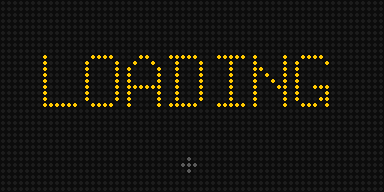

# Crypto Ticker 2.0

Crypto prices on an RGB LED matrix driven by a Raspberry Pi. This is an updated
version of the [Howchoo crypto ticker](https://howchoo.com/pi/raspberry-pi-cryptocurrency-ticker)
for current Raspberry Pi OS. The hardware is the same; the software is rewritten.

| `LAYOUT=classic` | `LAYOUT=chart` |
|--|--|
|  |  |

Each coin screen shows:

- the coin's icon (downloaded automatically and tuned to read well on LEDs)
- the ticker symbol and 24h change with a green ▲ or red ▼
- a 7-day sparkline (green if up over the week, red if down)
- the price, auto-sized to fit (`$109,235`, `$4,012.37`, `$0.0000123`)

Screens slide between coins. There's a loading screen, a `NO DATA` screen when
prices can't be fetched, and a small red dot in the corner if the prices shown
are stale. Optional night dimming.

## What changed from the original

| Problem in the old version | Fix |
|--|--|
| Docker image based on Debian Buster, which is end-of-life; the LED library also dropped the `make build-python` step the Dockerfile used | Runs natively in a Python virtual environment; `install.sh` builds the library the current way |
| CoinGecko symbol lookup matched every copycat token called "BTC" or "ETH" | Uses `/coins/markets?symbols=…`, which returns the top coin per ticker; `sym:coingecko-id` pins an exact coin |
| A failed price fetch crashed the program; the error screen pointed to a missing font | Retries, keeps showing the last prices, and shows a clear error screen |
| No icons, no transitions, no loading screen (all on the original author's wishlist) | Added |

The CoinMarketCap option was removed; CoinGecko covers everything with one API call per refresh.

## Hardware

- Raspberry Pi (Zero W/WH, 3, 4 or 5)
- 64×32 RGB LED matrix panel (64×64 and chained panels also work)
- Adafruit RGB Matrix Bonnet or HAT, and a 5V 4A power supply

## Install on the Pi

1. Flash **Raspberry Pi OS Lite** (Bookworm or newer) with Raspberry Pi Imager.
   Set Wi-Fi, a username, and enable SSH in the Imager settings.
2. SSH in and run:

   ```bash
   sudo apt-get install -y git
   git clone https://github.com/DNA2RNA1/crypto-ticker.git
   cd crypto-ticker
   ./install.sh
   nano settings.env        # pick your coins
   sudo reboot
   ```

The ticker starts automatically at boot.

| Task | Command |
|--|--|
| Check it's running | `sudo systemctl status crypto-ticker` |
| Watch the log | `journalctl -u crypto-ticker -f` |
| Apply settings changes | `sudo systemctl restart crypto-ticker` |
| Update the code | `git pull && sudo systemctl restart crypto-ticker` |
| Stop it | `sudo systemctl stop crypto-ticker` |

## Change coins and settings from your phone

The ticker runs a small settings page on your home Wi-Fi:

1. On your iPhone (same Wi-Fi), open **http://raspberrypi.local:8080** in Safari.
   Use your Pi's hostname if you changed it; `install.sh` prints the exact address.
2. Enter the PIN you chose during install.
3. Tap **Share → Add to Home Screen** to get an app icon.

From there you can search for and add coins (it shows each coin's rank and icon, so you pick
the real one and not a copycat), remove and reorder them, switch the layout, and set
brightness, time per coin, and night dimming. Changes show on the panel within a few seconds.

Five wrong PINs lock the page for 5 minutes. It's only reachable on your home network.
To change the PIN, edit `WEB_PIN` in `settings.env` and restart the ticker.

## Settings

All settings live in `settings.env`; see `settings.env.example` for the full list with comments.

| Name | Default | What it does |
|--|--|--|
| SYMBOLS | (starter list) | Coins to show, in order. `ada:cardano` pins an exact CoinGecko id |
| CURRENCY | usd | Price currency (usd, eur, gbp, …) |
| COINGECKO_API_KEY | | Optional free Demo API key |
| REFRESH_RATE | auto | `auto` refreshes as often as once a minute while staying under the monthly budget; or a fixed number of seconds (min 60) |
| MONTHLY_CALL_BUDGET | 10000 | CoinGecko calls allowed per month (free Demo plan: 10,000) |
| SLEEP | 5 | Seconds each coin is shown |
| TRANSITION | slide | `slide` or `none` |
| FEATURED | snek | Coins that get a big-picture screen first |
| LAYOUT | classic | `classic` (icon + mini chart), `chart` (full-screen 7-day chart behind the text), or `mix` (alternate) |
| BRIGHTNESS | 70 | 1–100 |
| DIM_HOURS / DIM_BRIGHTNESS | off / 15 | e.g. `22-7` dims from 10pm to 7am |
| DOWNLOAD_ICONS | true | Fetch coin icons automatically |
| WEB_PIN / WEB_PORT | (asked at install) / 8080 | Phone settings page PIN and port |
| LED_ROWS / LED_COLS / LED_CHAIN | 32 / 64 / 1 | Panel size |
| LED_GPIO_MAPPING | adafruit-hat | `adafruit-hat-pwm` if you soldered the PWM jumper |
| LED_SLOWDOWN_GPIO | 1 | Pi Zero 0–1, Pi 3 about 2, Pi 4/5 about 4. Raise it if the panel flickers |

**Custom icons:** on the phone settings page, tap a coin's picture and choose a photo; it's resized
and replaces the downloaded icon (tap *Reset picture* to undo). Or copy a PNG to `icons/<symbol>.png`.
Your pictures stay on the Pi (they're not committed to git).

**Featured coins:** tap ★ on the phone page (or set `FEATURED=snek`). A featured coin gets a
big-picture screen (large icon, symbol, 24h change and price) before its price screen.

## iPhone widget (home screen, lock screen, StandBy)

`iphone/CryptoTicker.js` is a widget for the free **Scriptable** app with the same chart look.

1. Install Scriptable from the App Store. Tap **+**, paste the whole file, and name it "Crypto Ticker".
2. Add a Scriptable widget, long-press it → **Edit Widget**: Script = Crypto Ticker, Parameter = a coin (`btc`, `pepe`, `night`).
   A medium widget takes up to three: `btc,ada,snek`.
3. For StandBy, add small Scriptable widgets to StandBy's stacks, one coin each, and swipe to switch.

iOS decides when widgets refresh (usually every 15–30 minutes); tapping the widget opens the coin on CoinGecko.
If the phone is offline, it keeps showing the last prices with an "offline" note.

## Preview without a Pi

```bash
pip install requests pillow
python preview.py --sample            # made-up prices, writes preview.gif
python preview.py                     # live prices
python preview.py --sample --rows 64  # preview a 64x64 panel
```

For a live on-screen emulator: `pip install RGBMatrixEmulator` then `python ticker.py --emulate`.

## Troubleshooting

- **Flicker or garbled pixels:** raise `LED_SLOWDOWN_GPIO` by 1 and restart.
- **`NO DATA / RATE LIMIT`:** use `REFRESH_RATE=auto` (or a slower rate), and add a free CoinGecko Demo key. The phone page shows this month's call count.
- **Wrong coin for a ticker:** pin it, e.g. `SYMBOLS=btc,uni:uniswap`.
- **Blank panel, service running:** check the log; make sure you rebooted after install (the audio driver must be off).

Price data from [CoinGecko](https://www.coingecko.com/en/api). Icons from CoinGecko, with
[spothq/cryptocurrency-icons](https://github.com/spothq/cryptocurrency-icons) as a fallback.
LED driver: [hzeller/rpi-rgb-led-matrix](https://github.com/hzeller/rpi-rgb-led-matrix).
